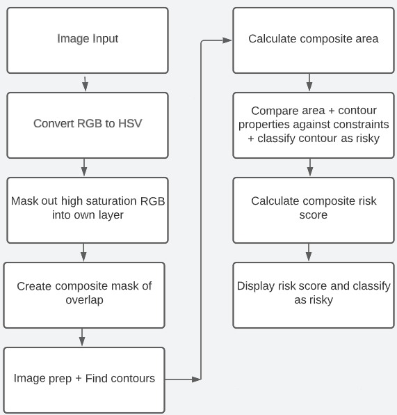

# Streaking Risk Analysis for Printing

The streaking risk analysis is a Python-based tool for analyzing the risk of streaking in a given image, which can be very useful in pre-emptively identifying potential issues in printing processes.

**_Note: See new section on Python Dependencies 5/12/2023_**

- [Streaking Risk Analysis for Printing](#streaking-risk-analysis-for-printing)
    - [Introduction](#introduction)
    - [Prerequisites](#prerequisites)
    - [Installation](#installation)
    - [Usage](#usage)
    - [Architecture and Functionality](#architecture-and-functionality)
    - [Research Findings and Iterations](#research-findings)
    - [Iterations](#iterations)
        - [Iteration1](#iteration-1)
        - [Iteration2](#iteration-2)
        - [Iteration3](#iteration-3)
    - [Future Considerations](#future-considerations)

## Introduction

Streaking is a common printing defect that leaves unwanted streaks on the paper caused by large coverage overlap areas. The paper wrinkles so much from all of the water that it hits the print head causing a streak to appear in the printing process.
This algorithm detects streaking by identifying significant areas of high saturation red, green, and blue and calculates a risk score based on the contents of the PDF determining whether the PDF is at risk of streaking.

## Prerequisites

The project can be run on any system that supports Python, including Windows, macOS, and Linux. No special hardware is required beyond a standard computer. The following tools and libraries are required:

- Python 3
- OpenCV (cv2)
- Numpy
- Treelib

## Installation

To install the necessary libraries, you can use pip, which is a package manager for Python. If you have Python installed, pip should also be available. Run the following commands in your terminal to install the necessary libraries:

```bash
pip install opencv-python
pip install numpy
pip install treelib
```    
## Usage

To run each python script, the test images must be in the same directory as the code. Each python script is run separately.

```bash
python3 streakRisk.py
python3 testingContoursTest.py
python3 testingContoursCompMask.py
```
The files testingContoursCompMask.py and testingContoursTest.py output their own respective text files containing information about each contour.

## Architecture and Functionality

- `mask images block`: Performs all masking on images and produces composite mask
- `find_tree()`: Finds hierarchical tree of contours based on parent_array
- `calculate_area()`: Calculates hierarchical area of all parents based on tree starting from bottom up
- `is_composite_area()`: Verifies if there is a composite area to be calculated from parent array
- `not_composite_area()`: Calculates area from non-composite contour
- `verify_contour()`: Calculates if each contour passes tests based on parameters, if yes, contour area is risky

The major blocks of my algorithm can be visualized as follows:



## Research Findings

The main goal of my algorithm was to find properties of risky areas of high saturation RGB to compare them against constraints. Masking out each individual color was very easy using a simple thresholding function and OpenCV's mask function to remove and isolate each color onto their own image and combine them. Combining them was also very easy as a simple ```bitwise_and()``` AND/OR ```bitwise_or()``` would do the trick depending on the situation. After many different considerations on how to calculate risky overlap area, I decided to use OpenCV's contours to achieve my desired output. 

The OpenCV function ```findContours()``` has different modes and point calculations which affect output of contours heavily. I found that the most appropriate mode was ```RETR_TREE``` as it outputs a full parent child hierarchy array of all contours and the most appropriate point calculation mode to be ```CHAIN_APPROX_SIMPLE``` as this provides enough information for the problem at hand. The hierarchy array is represented as a 2D numpy array of arrays. Each contour is represented as an array regarding its hierarchy within the contours with the four values: ```[Next Contour, Previous Contour, First Child, Parent]```.  The problem with the OpenCV function ```findContours()``` is that it finds the entire area of the contour including holes (which we don't want) and the question became, how can I calculate the composite area of each contour while preserving the properties of each contour. This is where the use of data structures and the manipulation of the hierarchy array comes in to find holes and the special case of holes within holes. At first I tried to just manipulate the hierarchy array to find the composite area of each contour, but it was too difficult without a data structure. 

After one iteration I realized that it was not possible without one data structure to at least track area, parents, and children. After two iterations I realized that it was not possible without a complex data structure to represent the whole array of contours. For the complex data structure, I decided  to use the Tree data structure as the hierarchy array seemed to be best represented as a tree. After implementing the two data structures it was a matter of traversing each one and finding the correct parent to subtract from. From there I compared the composite area of each contour against the constraints and the properties of each contour against the constraints to classify the contour as risky or not.

## Iterations
These are the iterations of my algorithm to find the composite area of each contour and compare them against constraints whilst also preserving the properties of each contour. This was the bulk of the project as this was the most important part of the algorithm.

### Iteration 1
First simple iteration of my algorithm for trying to find composite area. At this point I thought going through the hierarchy data structure would be enough to calculate each composite area subtracting holes. Then I was told about the case of holes within holes. The hierarchy array was not enough and did not provide enough information. I knew that I needed a data structure to keep track of each contour within the hierarchy array.
```
for i, contour in enumerate(contours):
    # If [0][i][2] is not -1, it has no children
    if hierarchy[0][i][2] == -1:
            cv2.drawContours(image, [contour], 0, (0, 255, 0), 2)
            print(cv2.contourArea(contour))
```

### Iteration 2:
Second iteration of my algorithm, a more complex version of iteration 1, manipulating the hierarchy array and keeping track of parents and children for later use in a simple data structure. This was a good implementation and worked in finding composite area but did not provide enough information afterwards for later usage to be viable. I need to create another data strucutre to store the full tree of contours.
```
# Find Holes and holes within holes
for i in range(len(contours1)):
    if(hierarchy1[0][i][3] != -1 and hierarchy1[0][i][2] == -1):
        area = cv2.contourArea(contours1[i])
        parentCur = hierarchy1[0][i][3]
        
        if parentPrev is None:
            print("none")
            parentPrev = parentCur
            
            parentArray.append(parentCur)
            parentAreaArray.append(cv2.contourArea(contours1[parentCur]))

            
        elif parentPrev != parentCur:
            print("new parent")
            parentPrev = parentCur
            parentArea = cv2.contourArea(contours1[parentCur])

            
            parentArray.append(parentCur)
            parentAreaArray.append(parentArea)
            idx += 1
        
        if parentPrev == parentCur:
            print("sub")
            parentAreaArray[idx] = parentAreaArray[idx] - area

        else:
            print("else")
            parentPrev = parentCur
            
        cv2.drawContours(image, contours1, i, (255, 0, 0), 2)
        cv2.namedWindow("CONTOURS", cv2.WINDOW_NORMAL)
        cv2.imshow("CONTOURS", image)
        cv2.waitKey(0)
        
    else:
        cv2.drawContours(image, contours1, i, (0, 255, 0), 2)
        cv2.namedWindow("CONTOURS", cv2.WINDOW_NORMAL)
        cv2.imshow("CONTOURS", image)
        cv2.waitKey(0)
```

### Iteration 3:
Third iteration of my algorithm, simplify the previous algorithm and store more information in my data structure. This is the point at which I realized that manipulation of the hierarchy array and a simple data structure would not be enough so I switched to using a more complex tree data structure and keeping the old parent array as it would be needed more for the calculation of composite area and constraints section. I chose to use a Tree data structure because this is what I though best represented the hierarchy array.
```
def find_tree(contours, hierarchy, parent_array, tree):
    
    # Create tree data structure with background as root element
    tree.create_node(0, 0)
    
    # Loop through all contours
    for i in range(len(contours)):
        
        # Indexes
        child_idx = hierarchy[0][i][2]
        
        # If child and not index 0 (background)
        if(child_idx != -1 and i != 0):
            
            # Create Children value array
            children = []
            
            children.append(i)
            children.append(cv2.contourArea(contours[i]))
            
            # Append to parent array
            parent_array.append(children)
    
    # Fill in Tree datastructure
    for i in range(len(parent_array)):
        
        # Index of contour in parent_array
        idx = parent_array[i][0]
        
        # Create parent node
        tree.create_node(idx, idx, parent=hierarchy[0][idx][3])
        
        # Create Child nodes based on parent node
        for j in range(len(contours)):
            if(hierarchy[0][j][3] == idx and hierarchy[0][j][2] == -1):
                tree.create_node(j, j, parent=idx)
    tree.show()
```

## Future Considerations
Some future considerations for this algorithm would be to use this image analysis algorithm for personal use but with different parameters. The parameters utilized in the project involved high saturation RGB values, but they can be easily adjusted since the core of the algorithm operates on an image composed of a composite mask derived from the input parameters. This approach would reduce the necessity of manually counting numerous images as it automatically calculates the composite area.

Further improvements for this algorithm could focus on enhancing efficiency by finding a more optimized way to store and search through the data structure representing the contours. Currently, the algorithm suffers from the time cost of ```for()``` loops and nested ```for()``` loops. This algorithm would benefit from utilizing a searching algorithm that would reduce time complexity and redundant searches utilizing logarithmic time complexity ```log(O)```.

Unfortunately, I was unable to implement this, but it remains an area for potential improvement in the future as time complexity is a big problem with algorithms working with large amounts of data. Additionally, I was unable to discover a method to identify all holes and nested holes solely using the hierarchy array without employing additional data structures. However, this is another aspect that could be considered for future enhancements but I do not know if it is possible or not.

Lastly, the next step for the streaking algorithm would be to combine the streakRisk and testingContoursCompMask files (after more testing to make sure it works on real images) and evaluate the algorithm on real images rather than test images and verify the results on real images. This algorithm needs to undergo much more testing in the future. I was unable to do much testing on real images and mostly did testing on the test image that I was given to verify that the core of the algorithm works correctly. After undergoing much more testing the entire algorithm and constraints would need to be optimized based on further testing on real images. Also other test constraints could be added to evaluate each contour based on feedback from Pieter.
